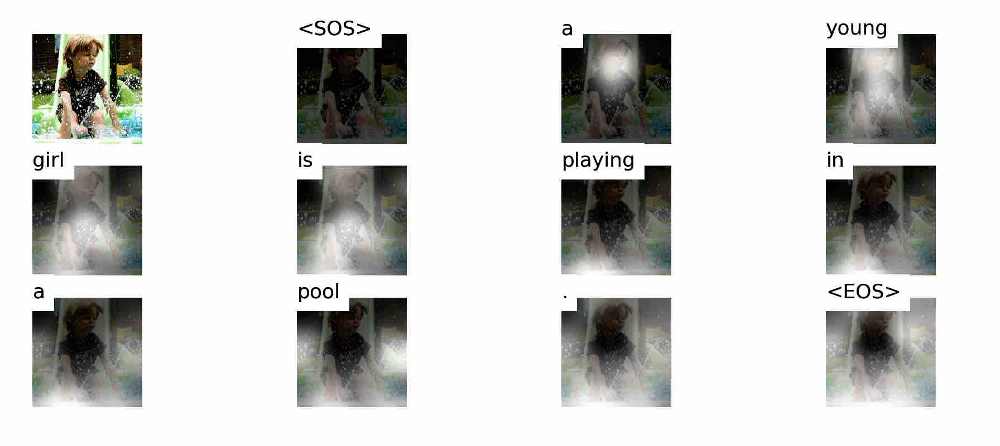
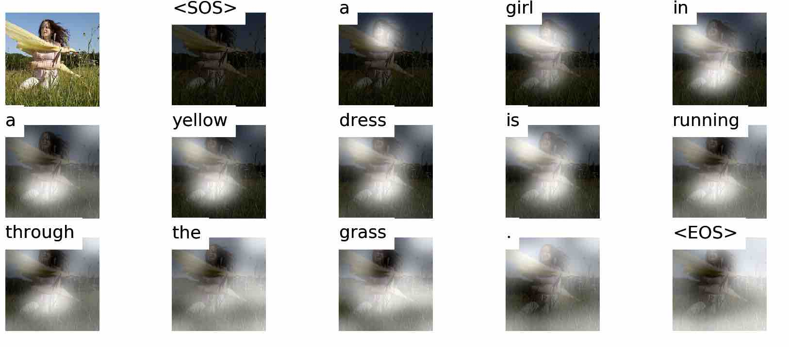
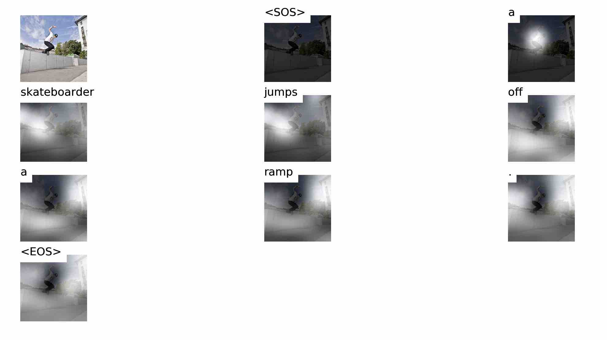

# Show_Attend_and_Tell
Implementation of SAT (Show, Attend and Tell)

## Quick start

### Training
```
python main.py --epochs [epoch]
```

### Inference
```
python main.py --prev_model [model_name] --inference --img_path ./data/Flicker8k/images/[img_name]
```

## Captioned Image Example





## Reference
1. Show, Attend and Tell: Neural Image Caption Generation with Visual Attention   
(https://arxiv.org/abs/1502.03044)
2. Flickr8k Dataset   
(https://www.kaggle.com/adityajn105/flickr8k
https://github.com/AaronCCWong/Show-Attend-and-Tell